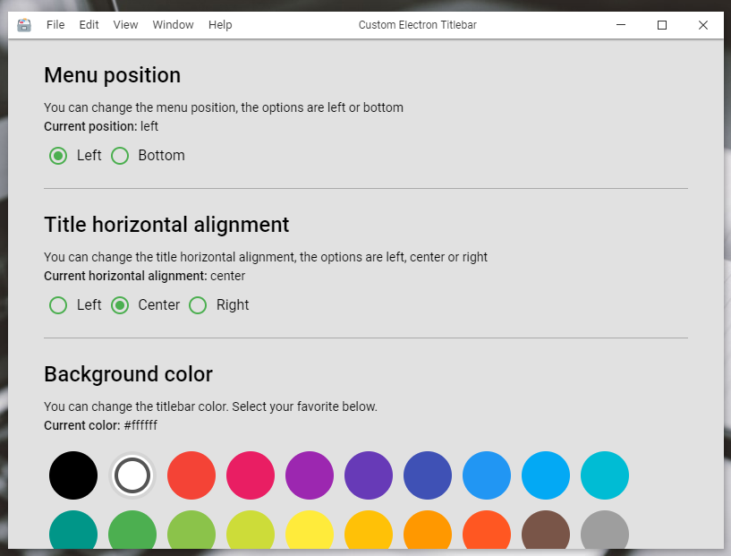

# cet-quickstart

This is a example for start an electron app with [CET (Custom Electron Titlebar)](https://github.com/Inceldes/cet)



## Usage

To use this example, clone this repository

```
git clone https://github.com/AlexTorresSk/cet-quickstart.git
```

For more information visit: [CET (Custom Electron Titlebar)](https://github.com/Inceldes/cet)
